# Totito - Usuario vrs Computadora (java consola - sin clases - static)

A continuación voy a hacer una breve descripción de una solución para un juego de totito el cual permita jugar contra la computadora, la computadora debe realizar el tiro más inteligente posible.

En el siguiente enlace se encuentran tres vídeos de como lo elaboramos paso a paso [Enlace de vídeos](https://www.youtube.com/playlist?list=PL3Fp-jy-GCuVY-HzCIMLZxXeTUNw7q5-R)

## Consideraciones
 
 Es para el curso de programación de computadoras 1 del CUNOC/USAC, el objetivo de este ejemplo es mostrar las ventajas de utilizar programación modular, por esta razón no se usaran clases. Por lo tanto la solución estará en consola. 

 ## Ejecución

 Dado que es solo un archivo desde java 11 lo podemos ejecutar de la siguiente manera:

 ```bash
 java Totito.java
 ```

 ## Acerca del juego 

El juego consiste en que se tiene una matriz de tres por tres en la que dos jugadores en cada turno pueden poner una ficha, usualmente se usa "X" y "O". El objetivo es conseguir tres figuras iguales contiguas, puede ser horizontal, vertical u oblicuo. 
<a name="etiqueta"></a>
##titulo
 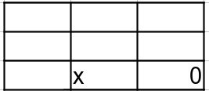

En la siguiente gráfica se muestra en verde partidas en las cuales el jugador gana, en rojo se muestran la posición de fichas que no funcionan para ganar. 

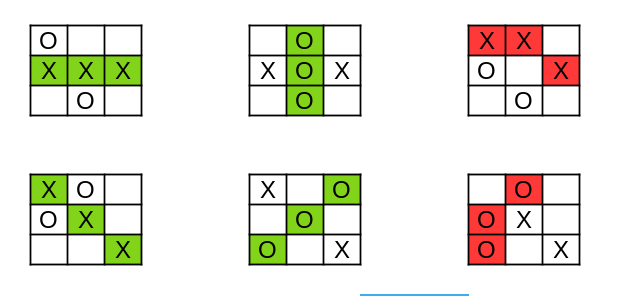

## Aproximación a la solución 

 Para solucionar este problema utilizaremos el pensamiento computacional. Para esta solución tratare de no pintar una matriz sencilla, sino trataremos de que la visualización sea un poco más elaborada a pesar que lo estamos haciendo en consola. 

 No describire cada parte del pensamiento computacional, me enfocaré más en la parte de la descomposición. La solución completa la dividimos de la siguiente manera:

0. [Manejar la información de la partida](#0-informacion-partida)
1. [Pintar el tablero](#1-pintar-tablero)
    * Pintar una casilla
    * Pintar casillas contiguas 
    * Pintar el tablero completo
2. [Tiro del usuario](#2-tiro-del-usuario)
    * Solicitar coordenadas 
    * Verficiar que el tiro sea posible
    * Agregarlo al juego 
3. [Tiro de la computadora](#3-tiro-de-la-computadora)
    * Verificar los espacios disponibles para tirar
    * Valorar para encontrar el mejor tiro
    * Realizar el tiro 
4. [Lógica del juego](#4-logica-juego)
    * Random para los jugadores
    * Inicializar variables
    * Permitir que los jugadores tiren
    * Verificar que si hay tiros posibles aún
    * Verificar si hay un ganador

<a name="0-informacion-partida"></a>
### 0. Manejar la información de la partida

Para pintar el tablero primero revisamos como guardar nuestra matriz para manejar la información de la partida. Utilizaremos una matriz de enteros. La información del tablero la vamos abstraer de la siguiente manera: 

Esta es la representación sencilla


La abstraemos de la siguiente manera

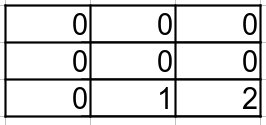

Por lo tanto la información es representada de la siguiente manera:

* **0**: representa una casilla vacía
* **1**: representa una ocupada por "X"
* **2**: representa una ocupada por "O"
<a name="1-pintar-tablero"></a>
### 1. Pintar el tablero

Ya que definimos la forma de manejar la información de la partida, ahora vamos a ver la forma de pintar el tablero de una manera más agradable que solo utilizar un carácter para representar cada parte del tablero. 

Dado que tenemos casillas en blanco, x y O, vamos a tratar de pintarlo de la siguiente manera 


En la imagen se muestra que utilizaremos tres lineas para pintar cada una casilla, además utilizaremos cuatro caracteres por línea para presentar cada espacio. Al momento de juntar cada casilla lo veremos de la siguiente manera:

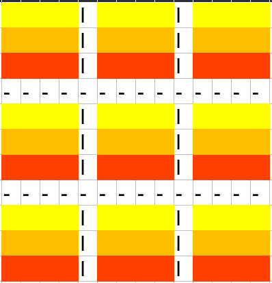

Vamos a separar cada parte del tablero con "|" y con "-". 

Para esto utilizamos los métodos en el código:

* **pintarFila**: el cual recibe el tipo de casilla que se debe de pintar y retorna 4 carácteres para pintar una línea en específico de la casilla. 
* **pintarTablero**: recorre toda la matriz y utiliza pintarFila para poner una parte de la línea a la par de la otra hasta tener el tablero completo. 
<a name="2-tiro-del-usuario"></a>
### 2. Tiro del usuario 

Para manejar el tiro del usuario solo tenemos un método que se encarga de solicitar el lugar donde quiere hacer su siguiente jugada, revisa que realmente el espacio este vacio, de lo contrario solicita que se vuelva a pedir una posición valida.  
<a name="3-tiro-de-la-computadora"></a>
### 3. Tiro de la computadora

Esta parte se vuelve un poco más compleja, y necesitamos definir un procedimiento para que la computadora pueda elegir el tiro que le convenga más. Para esto vamos a responder las siguientes preguntas y asignarle una prioridad:

1. ¿Puedo ganar en este turno? 
2. ¿El jugador puede ganar en el siguiente turno?
3. ¿Tengo posibilidad de ganar dos turnos adelante
4. ¿El jugador tiene posibilidad de ganar dos turnos adelante?
4. Un tiro que no significa nada. 

Res pondiendo esto vamos a plantear el tablero como una matriz de posibilidades con la siguiente estructura:

| Valor Casilla | Descripción                                                                                                                                             |
| ------------- | ------------------------------------------------------------------------------------------------------------------------------------------------------- |
| 0             | El tiro no es posible, la casilla esta ocupada.                                                                                                         |
| 1             | Es el peor tiro que puede hacerse, no tiene ningún beneficio.                                                                                           |
| 4             | Significa que hay dos lugares consecutivos seguidos y una ficha del jugador rival, y si el jugador los ocupa, puede ganar en dos turnos.                |
| 5             | Significa que hay dos lugares vacíos consecutivos, en línea con una ficha de la computadora, quiere decir que la computadora puede ganar en dos turnos. |
| 10            | Significa que la casilla esta vacía y tiene dos fichas en línea del jugador rival, **el jugador rival gana en el siguiente turno**.                     |
| 15            | Significa que la casilla esta vacía, y en línea hay dos fichas que pertenecen a la computadora. En el **siguiente turno gana la computadora**.          |

Lo que buscamos es con estos datos poder llegar a tener un una matriz valorada de la siguiente manera:

Para poder llegar a tener algo de la siguiente manera: 

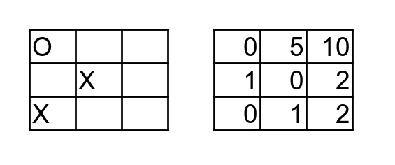

Realizando esto se nos facilita la desición de ejecutar el siguiente tiro. Simplemente buscamos el valor más alto. En el caso de que tengamos varios podemos seleccionar aleatoriamente o agregarle más lógica para definir si podemos aumentar la presición de las prioridades. 

En el caso de las **comparaciones** para definir esta matriz la lógica que se siguio fue la siguiente:

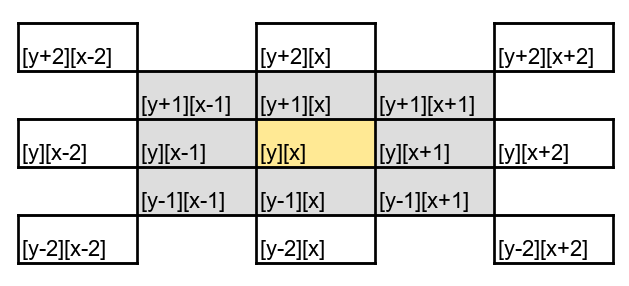

La imagen anterior tiene las siguientes consideraciones, 1) la única parte de del tablero es la que esta marcada en gris. 2) los cuadros extras que estan en blanco sirvieron para considerar que debiamos revisar los límites del tablero para evitar un error en tiempo de ejecución.

Si tomamos en cuenta que estamos ubicados en la posición **[y][x]** debemos de revisar lo siguiente:

* **Vertical**: debemos revisar las posibilidades hacía arriba y abajo. 
* **Horizontal**: debemos revisar las posibilidades de derecha a izquierda
* **Diagonal**: debemos tomar en cuenta las posibilidades en diagonal. 
<a name="4-logica-juego"></a>
### Lógica del juego

La lógica del juego es bastante sencilla, al inicial la partida hay un random para decidir el jugador que inicia con la partida, tambien hay una parte de estadisticas. Se encarga de revisar si hay un jugador que haya ganado a cada tiro de los jugadores. 

A continuación se muestra el funcionamiento del juego

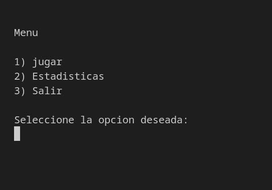 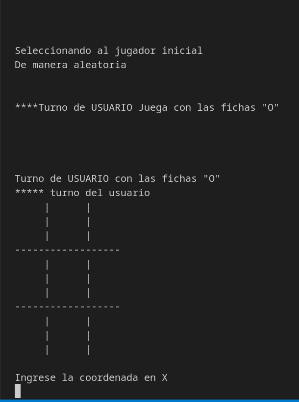
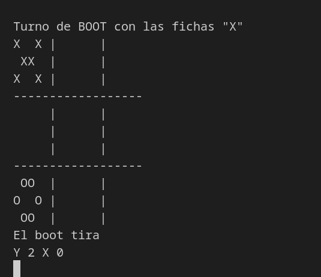 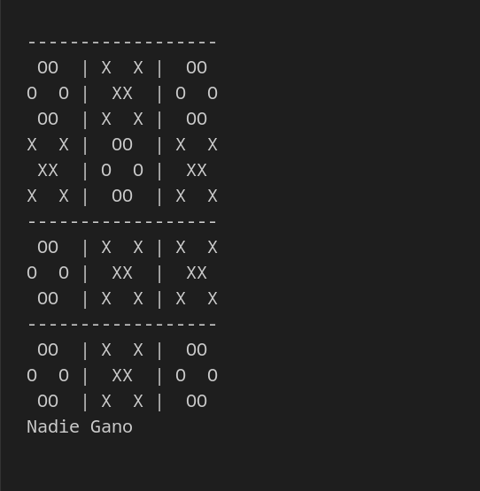
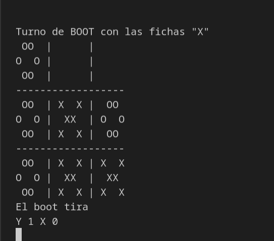 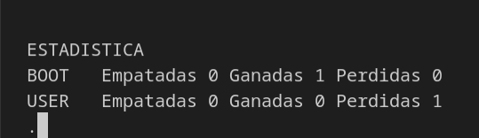


